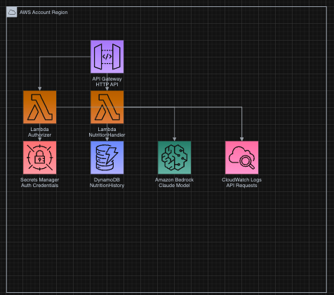

# Insulin Calculation and Nutrition History API

This project implements an AWS-based API for calculating insulin dosage and managing nutrition history for diabetic patients.

The Insulin Calculation and Nutrition History API is a serverless application built using AWS CDK. It provides a secure and scalable solution for calculating insulin dosage based on food intake, blood glucose levels, and other factors. The API also stores nutrition history in a DynamoDB table for future reference and analysis.

Key features include:
- Secure API authentication using AWS API Gateway and Lambda authorizer
- Insulin dosage calculation using a machine learning model (AWS Bedrock)
- Nutrition history storage in DynamoDB
- Serverless architecture for high scalability and low maintenance

## Repository Structure

```
.
├── app.py                  # CDK app entry point
├── cdk.json                # CDK configuration file
├── insulin_calc/
│   └── insulin_calc_stack.py  # Main CDK stack definition
├── lambda/
│   ├── authorizer/
│   │   └── index.py        # Lambda authorizer function
│   └── handler/
│       ├── index.py        # Main Lambda handler for insulin calculation
│       └── test_index.py   # Unit tests for the handler
├── optimization_2.py       # Optimization script for insulin dosage calculation
├── README.md
└── tests/
    └── unit/
        └── test_insulin_calc_stack.py  # Unit tests for the CDK stack
```

## Usage Instructions

### Installation

Prerequisites:
- Python 3.12 or later
- AWS CDK CLI
- AWS CLI configured with appropriate credentials

Steps:
1. Clone the repository
2. Navigate to the project directory
3. Create a virtual environment: `python -m venv .venv`
4. Activate the virtual environment:
   - On Windows: `.venv\Scripts\activate`
   - On Unix or MacOS: `source .venv/bin/activate`
5. Install dependencies: `pip install -r requirements.txt`
6. Deploy the stack: `cdk deploy`

### Configuration

The main configuration for the stack is in `insulin_calc/insulin_calc_stack.py`. Key configuration options include:
- DynamoDB table name
- Lambda function names
- API Gateway settings
- IAM roles and policies

Environment variables are used for sensitive information and are set during the CDK deployment process.

### API Usage

The API provides an endpoint for calculating insulin dosage. To use the API:

1. Obtain API credentials (username and password) from AWS Secrets Manager after deployment.
2. Make a POST request to the API endpoint with the following JSON payload:

```json
{
  "DeviceId": "user123",
  "Date": "2023-06-15T14:30:00Z",
  "Foods": {
    "Apple": "100",
    "Chicken Breast": "150"
  },
  "BloodGlucose": "120",
  "ICR": "10",
  "CF": "40"
}
```

3. The API will return the calculated insulin dosage and store the nutrition history in DynamoDB.

### Testing

To run unit tests:

1. Navigate to the `tests/unit` directory
2. Run `pytest`

To run handler unit tests:

1. Navigate to the `lambda/handler` directory
2. Run `pytest test_index.py`

### Troubleshooting

Common issues and solutions:

1. API Authentication Failure
   - Error message: "Could not authenticate user!"
   - Solution: Verify that you're using the correct username and password from Secrets Manager.

2. Lambda Function Errors
   - Check CloudWatch Logs for the specific Lambda function (SqsHandlerFunction or AuthorizerFunction)
   - Ensure that the required environment variables are set correctly

3. DynamoDB Access Issues
   - Verify that the IAM roles have the correct permissions for DynamoDB actions
   - Check that the table name in the Lambda function matches the deployed table name

For debugging:
- Enable verbose logging in Lambda functions by setting the log level to DEBUG
- Use AWS X-Ray for tracing requests through the application

## Data Flow

The request data flow through the application is as follows:

1. Client sends an authenticated request to the API Gateway
2. API Gateway invokes the Lambda authorizer to validate credentials
3. If authorized, the main handler Lambda function is invoked
4. The handler function:
   a. Retrieves nutritional information using the Bedrock inference model
   b. Calculates the insulin dosage
   c. Stores the nutrition history in DynamoDB
5. The calculated insulin dosage is returned to the client

```
[Client] -> [API Gateway] -> [Authorizer Lambda]
                          -> [Handler Lambda] -> [Bedrock inference model]
                                               -> [DynamoDB]
                          <- [Response to Client]
```

## Infrastructure

The project uses AWS CDK to define and deploy the following resources:

- Lambda:
  - SqsHandlerFunction: Processes API requests, calculates insulin dosage,insulin dosage timing, and stores nutrition history
  - AuthorizerFunction: Handles API authentication
  - AWSSDKPandas Layer: Provides additional libraries for the Lambda functions

- DynamoDB:
  - NutritionHistory: Stores nutrition and insulin dosage history

- AWS Bedrock:
  - Used for retrieving nutritional information and insulin dosage calculation

